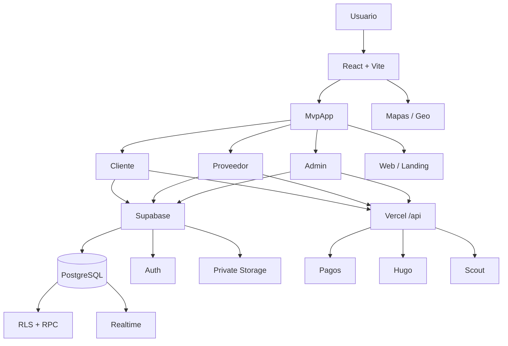

# UGO — Arquitectura Técnica Master

**Versión:** 1.0 · 11 de septiembre de 2026  
**Estado:** contrato técnico vivo · fuente de verdad de arquitectura  
**Repositorio:** `sebastisnzoth/ugo-admin-panel`  
**Rama de integración:** `main`  
**Complementa:** `UGO_ECOSISTEMA_FLUJO.md`, `UGO_UIUX_MAESTRO.md`, `UGO_UIUX_STITCH_MASTER.md`

> Este documento define **cómo está construido UGO y cómo debe evolucionar técnicamente sin romper el ecosistema**. El flujo maestro define qué ocurre; UI/UX define cómo se entiende; este documento define dónde vive cada responsabilidad, cómo se comunica y qué contratos técnicos deben preservarse.

---

# 1. Principios de arquitectura

1. `main` es la fuente de verdad integrada.
2. No crear un segundo UGO paralelo para resolver una pantalla.
3. Cliente, Proveedor, Admin y Web comparten dominio, estados y Design System, pero conservan responsabilidades por rol.
4. La UI nunca reemplaza seguridad de backend.
5. Supabase RLS/RPC/Storage son contratos de seguridad y dominio, no detalles visuales.
6. Realtime sincroniza estado; no inventa estado.
7. Los pagos deben distinguir método, protección y estado real.
8. Toda nueva función debe integrarse al flujo maestro antes de generar rutas o overlays independientes.
9. Stitch es referencia visual; React/Supabase son aplicación real.
10. Arquitectura objetivo: simple, trazable, de bajo costo y desplegable en infraestructura serverless.

---

# 2. Stack verificado

Frontend:

```text
React 19
TypeScript 6
Vite 8
CSS / Design System UGO
```

Backend / datos:

```text
Supabase JS 2
PostgreSQL
Auth
RLS
RPC
Realtime
Storage privado
```

Mapas/geografía:

```text
MapLibre GL
TomTom Maps SDK
Overpass / OSM en funciones existentes
```

Runtime/API:

```text
Vercel serverless functions bajo /api
Node/TypeScript/JavaScript según endpoint
```

Otros módulos existentes:

```text
Hugo
Scout
KYC
Pagos
Retiros
WhatsApp
Cascade/proxy
XLSX/reporting
```

Build canónico:

```bash
npm run build
# tsc -b && vite build
```

---

# 3. Topología general



---

# 4. Entrada y routing actual

`src/main.tsx` es bootstrap. La selección principal de superficies vive en `src/mvp/MvpApp.tsx` mediante query parameter `app`.

Contrato actual:

```text
?app=client-web
?app=web-client
?app=stitch-client  → UgoClientWeb

?app=client         → RecoveryGate(client)
                      → ClientFlowProvider
                      → ClientRoot

?app=provider       → RecoveryGate(provider)
                      → ProviderFlowProvider
                      → ProviderRoot

?app=admin          → AdminGate
?app=web            → UgoWeb
default             → UgoLanding
```

Regla: no agregar rutas ad-hoc que dupliquen un rol. Una nueva pantalla debe entrar al flow/router del rol correspondiente.

---

# 5. Arquitectura Cliente

Capas:

```text
MvpApp
→ RecoveryGate(client)
→ ClientFlowProvider
→ ClientRoot
→ experiencia / módulos transversales
```

`ClientFlowProvider` es el contrato de navegación/acciones del journey. Las pantallas no deben navegar mediante hacks DOM si existe una acción del flow.

Módulos transversales actualmente montados incluyen:

```text
ClientOnboardingGate
ClientGlobalMenu
ClientRequestEvidence
ClientCompletionReview
ClientCashPaymentOption
ServiceExpansionPanel
ServiceHistoryPanel
DisputeDock
AppLocationButton
```

Dirección objetivo: integrar visualmente estos módulos dentro del journey correspondiente y evitar overlays globales superpuestos.

---

# 6. Arquitectura Proveedor

```text
MvpApp
→ RecoveryGate(provider)
→ ProviderFlowProvider
→ ProviderRoot
→ ProviderDataProvider
→ Home / Demanda / Oportunidades / Trabajo activo / Perfil
```

Separación:

```text
providerTypes.ts       contratos tipados
providerFlow.tsx       navegación/acciones
providerData.tsx       estado operacional + mutaciones
providerService.ts     acceso a Supabase/RPC
useProviderRealtime.ts sincronización
ProviderRoot.tsx       shell
```

Regla: no revivir `ProviderApp` legacy como segunda aplicación. Comportamientos útiles históricos deben migrarse al provider actual.

---

# 7. Admin y Super Admin

Admin entra mediante `AdminGate` y debe operar como Control Center.

Arquitectura conceptual:

```text
Auth / role gate
→ shell administrativo
→ Operaciones
→ Personas
→ Finanzas
→ Seguridad/Disputas
→ Scout
→ Reportes
→ Configuración
```

Super Admin amplía gobernanza:

```text
roles/permisos
feature flags
categorías
zonas
matching
finanzas
Hugo
Scout
integraciones
auditoría
métricas globales
```

Toda acción privilegiada debe validarse en backend/RLS/RPC; ocultar un botón no constituye autorización.

---

# 8. Modelo de dominio maestro

Estado de servicio:

```text
solicitado
→ buscando
→ ofertado
→ asignado
→ pago_pendiente
→ pago_protegido
→ en_camino
→ llegado
→ en_progreso
→ esperando_aprobacion
→ completado
```

Excepciones:

```text
cancelado
disputado
reembolsado
```

Proveedor:

```text
offline
→ available
→ opportunity_pending
→ assigned
→ busy
→ completion_pending
→ available
```

Pago electrónico:

```text
pendiente → autorizado → retenido/protegido → liberado → pagado
```

Efectivo:

```text
seleccionado/presencial pendiente → recibido confirmado → registrado/liberado
```

Regla absoluta: efectivo no es electrónicamente protegido.

---

# 9. Supabase y acceso por rol

El frontend debe obtener el cliente Supabase correspondiente al rol mediante la infraestructura compartida (`getRoleSupabase` y helpers relacionados).

No crear clientes Supabase arbitrarios por componente.

Responsabilidades:

```text
Auth      identidad y sesión
RLS       autorización por fila
RPC       transiciones/mutaciones críticas
Realtime  actualización reactiva
Storage   evidencia/documentos privados
```

Las credenciales privilegiadas nunca deben enviarse al browser.

---

# 10. Realtime

Realtime debe concentrarse por dominio/rol para evitar múltiples subscriptions equivalentes.

Proveedor actual escucha principalmente:

```text
ofertas_servicio
servicios
pagos
perfil proveedor
```

También existen eventos para evidencia y ampliaciones.

Reglas:

- filtrar por servicio/usuario cuando sea posible;
- cleanup obligatorio al desmontar;
- callbacks estables para evitar resuscripción en cada render;
- Realtime dispara reload/patch de datos reales, no crea estados paralelos;
- fallback de refetch ante reconexión.

---

# 11. Evidencias y Storage

Dos dominios separados:

## Evidencia de solicitud

```text
Cliente sube fotos
→ request-evidence privado
→ evidencias_solicitud
→ se vincula al servicio
→ proveedor autorizado puede analizar antes de aceptar
```

## Evidencia operacional

```text
Antes → Durante → Después
```

Bucket:

```text
service-evidence
```

Tabla:

```text
evidencias_servicio
```

Principios:

- buckets privados;
- signed URLs;
- límites MIME/tamaño;
- RLS de participantes;
- el proveedor sólo carga cuando el estado operacional lo permite;
- no mezclar evidencia previa con evidencia de ejecución.

Deuda conocida: sustituir el enlace temporal de evidencia previa por un identificador explícito de draft/solicitud para evitar asociación ambigua.

---

# 12. Ampliar servicio

Dominio:

```text
ampliaciones_servicio
```

Contrato:

```text
cliente/proveedor propone
→ descripción
→ monto extra
→ minutos extra
→ cliente aprueba/rechaza
→ ajuste trazable
```

Estados:

```text
pendiente | aprobada | rechazada | cancelada
```

Pago:

```text
no_aplica | incluido | pendiente_ajuste
```

Un pago electrónico ya retenido nunca debe modificarse silenciosamente.

---

# 13. Pagos

Endpoints serverless viven bajo `api/pagos/`.

Métodos pueden evolucionar por país, pero la UI consume un contrato común de estado.

Efectivo tiene endpoints propios para selección/registro y confirmación del proveedor.

Reglas:

- idempotencia para operaciones monetarias;
- validar identidad/servicio en servidor;
- no confiar en importe enviado por UI sin reconciliar con DB;
- separar DEMO y REAL;
- registrar referencias externas;
- toda liberación/cobro debe ser auditable;
- expansión de servicio debe reconciliarse con pago.

---

# 14. API serverless

El repositorio contiene `/api` con dominios como:

```text
/api/hugo
/api/kyc
/api/pagos
/api/retiros
/api/scout
/api/whatsapp
/api/cascade.js
/api/proxy.js
/api/overpass.js
```

Regla de frontera:

Frontend → API cuando se requiere secreto, proveedor externo, lógica server-side o privilegio que no debe residir en browser.

Frontend → Supabase directamente para operaciones permitidas por RLS y contratos de dominio seguros.

---

# 15. Hugo

Hugo es una capacidad transversal, no una navegación paralela.

```text
Cliente: descubrimiento, explicación y ayuda contextual
Proveedor: Asistente de Trabajo antes/durante/después
Admin: soporte a interpretación/operación cuando corresponda
```

Las llamadas que requieran proveedores/modelos secretos deben pasar por `/api/hugo` o backend autorizado.

Hugo no debe poder saltarse reglas de servicio, pago, autorización o seguridad.

---

# 16. Scout

Scout transforma datos en acción:

```text
Dato → interpretación → recomendación → acción → resultado
```

Fuentes futuras/actuales pueden incluir:

```text
demanda
oferta
matching
conversiones
zonas
operaciones
campañas
calidad
proveedores
```

Las recomendaciones deben conservar evidencia, confianza y contexto. Scout no modifica estados críticos sin una acción explícita autorizada.

---

# 17. Geolocalización y mapas

Stack disponible: MapLibre/TomTom y servicios OSM/Overpass existentes.

Separar:

```text
posición actual
geocoding/dirección
tracking
ETA/routing
visualización de demanda
inteligencia geográfica Scout
```

No acoplar lógica de negocio a un proveedor cartográfico único. La ausencia temporal del mapa no debe bloquear un servicio que pueda continuar mediante dirección/contexto textual.

---

# 18. Notificaciones

Contrato objetivo:

```text
evento de dominio
→ persistencia/notificación
→ canal correspondiente
→ UI actualizada
```

Canales pueden incluir in-app, realtime, email/WhatsApp/push cuando estén habilitados.

No disparar notificaciones desde componentes puramente visuales si el evento debe ser auditable en backend.

---

# 19. Design System y Stitch

Fuente visual:

```text
ugo-design-system.css
UGO_UIUX_MAESTRO.md
UGO_UIUX_STITCH_MASTER.md
```

Google Stitch:

```text
explora UI
→ export/reference
→ revisión
→ adaptación a componentes UGO
→ implementación React/CSS
```

Nunca iframear Stitch ni mantener una aplicación HTML paralela.

---

# 20. Seguridad

Capas mínimas:

```text
Auth
→ rol
→ RLS
→ validación RPC/API
→ storage policy
→ auditoría
```

Requisitos:

- no exponer service role keys;
- validar ownership y participación;
- signed URLs para privado;
- limitar uploads;
- sanitizar/validar inputs server-side;
- acciones críticas idempotentes;
- no confiar en estado visual del frontend;
- registrar cambios financieros y administrativos.

---

# 21. DEMO vs REAL

DEMO sirve para pruebas, no puede confundirse con producción.

Todo módulo financiero/operacional debe poder distinguir explícitamente:

```text
DEMO
REAL
```

No presentar transacciones simuladas como dinero real, ni permitir que datos demo contaminen métricas reales.

---

# 22. Deployment

Objetivo actual:

```text
GitHub main
→ build TypeScript/Vite
→ Vercel
→ frontend + serverless API
→ Supabase externo
```

Antes de considerar una modificación terminada:

```text
TypeScript
build
lint cuando aplique
flujo afectado
responsive
RLS/API
Realtime
pagos si aplica
Vercel/CI
```

No declarar deploy correcto sólo porque el commit existe.

---

# 23. Gestión de ramas

La auditoría actual detectó numerosas ramas históricas. Regla:

- `main` = integración actual;
- ramas históricas no se mergean completas por defecto;
- rescatar commits/archivos selectivamente;
- comparar contra main;
- clasificar: integrado / parcialmente integrado / único / obsoleto;
- borrar sólo después de verificar que no existe trabajo único útil.

Ramas Stitch son principalmente referencia de diseño; sus exports no sustituyen implementación actual.

---

# 24. Deuda técnica prioritaria

## P0

- verificar build/TypeScript después de integraciones recientes;
- asegurar contrato de `serviceId` en oportunidades proveedor;
- hacer wording de cierre dependiente del método de pago;
- evitar Provider legacy como salida operacional;
- integrar overlays Cliente dentro del journey real;
- garantizar guards backend de evidencia para transiciones críticas.

## P1

- Payment Timeline compartido y realtime;
- tracking/ETA Cliente-Proveedor;
- notificaciones unificadas;
- estabilizar callbacks/subscriptions Realtime;
- draft explícito para evidencia de solicitud;
- consolidar variantes visuales Cliente/Stitch.

## P2

- Scout con demanda independiente de ofertas concretas;
- observabilidad estructurada;
- pruebas E2E completas;
- contratos API versionados cuando la escala lo requiera.

---

# 25. Regla para nuevas funcionalidades

Antes de implementar:

```text
1. identificar estado de dominio
2. identificar rol autorizado
3. definir dato/tablas/RPC/API
4. definir seguridad/RLS
5. definir eventos Realtime/notificación
6. definir contrato UI/UX
7. implementar
8. probar happy/error/offline
9. verificar build
10. actualizar documentación maestra
```

Si una función no puede ubicarse en este flujo, todavía no está suficientemente diseñada.

---

# 26. Documentos maestros y autoridad

```text
UGO_ECOSISTEMA_FLUJO.md
→ autoridad funcional

UGO_ARQUITECTURA_TECNICA_MASTER.md
→ autoridad de estructura técnica

UGO_UIUX_MAESTRO.md
→ autoridad UX transversal

UGO_UIUX_STITCH_MASTER.md
→ autoridad de generación/adaptación visual Stitch
```

Próximos documentos especializados recomendados:

```text
UGO_DATA_BACKEND_MASTER.md
UGO_TESTING_RELEASE_MASTER.md
UGO_ROADMAP_MASTER.md
```

---

# 27. Regla final

**Una sola plataforma, un solo dominio, un solo flujo de estados y múltiples experiencias por rol.**

Toda evolución técnica debe aumentar confianza, trazabilidad, mantenibilidad y capacidad de escalar UGO sin crear implementaciones paralelas.