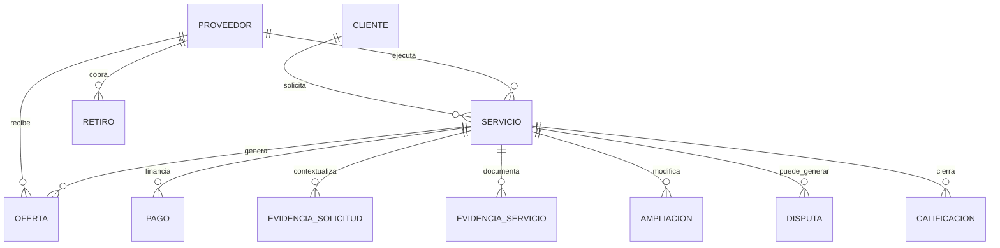

# UGO — Data & Backend Master

**Versión:** 1.0 · 11 de septiembre de 2026  
**Estado:** contrato vivo de datos, Supabase y backend  
**Rama de verdad:** `main`  
**Complementa:** `UGO_ECOSISTEMA_FLUJO.md` y `UGO_ARQUITECTURA_TECNICA_MASTER.md`

> Define cómo UGO persiste, protege, sincroniza y transforma datos. Las migraciones SQL de `main` son la evidencia ejecutable; este documento es el mapa conceptual que debe mantenerse alineado con ellas.

---

# 1. Principios

- PostgreSQL/Supabase es la fuente persistente de verdad operacional.
- RLS protege por rol/participación; la UI nunca reemplaza autorización.
- RPC encapsula transiciones críticas y evita mutaciones parciales.
- Realtime refleja cambios persistidos; no mantiene un segundo estado de dominio.
- Storage privado para evidencia/documentación sensible.
- Toda evolución de schema se realiza mediante migración versionada.
- DEMO y REAL deben permanecer distinguibles.
- Dinero y estados críticos deben ser auditables e idempotentes.

---

# 2. Dominios de datos

```text
Identidad/Auth
Clientes
Proveedores
Categorías
Servicios
Ofertas/Matching
Ubicación/Tracking
Pagos
Retiros
Evidencias
Ampliaciones
Disputas
Calificaciones
Notificaciones
KYC/Verificación
Scout/Analytics
Hugo/IA
Auditoría
```

---

# 3. Relaciones conceptuales



Los nombres exactos de columnas/FK se verifican siempre contra las migraciones vigentes.

---

# 4. Estado maestro de Servicio

```text
solicitado → buscando → ofertado → asignado
→ pago_pendiente → pago_protegido
→ en_camino → llegado → en_progreso
→ esperando_aprobacion → completado
```

Excepciones: `cancelado`, `disputado`, `reembolsado`.

Las transiciones sensibles deben residir en RPC/backend, con validación del actor y estado anterior.

---

# 5. Proveedor y matching

Estado conceptual:

```text
offline → available → opportunity_pending → assigned
→ busy → completion_pending → available
```

`ofertas_servicio` representa oportunidades concretas. Demanda de mercado es un concepto analítico distinto y no debe derivarse necesariamente de la misma lista cuando Scout/datos permitan una fuente independiente.

Aceptar/rechazar oferta debe ser atómico y proteger contra doble aceptación.

---

# 6. Pagos

Dominio `pagos` y APIs bajo `/api/pagos`.

Electrónico:

```text
pendiente → autorizado → retenido/protegido → liberado → pagado
```

Efectivo:

```text
metodo=efectivo
procesador=efectivo
modelo_pago=presencial
estado=pendiente
→ proveedor confirma recepción
→ liberado/registrado
```

Reglas:

- efectivo nunca se considera electrónicamente protegido;
- reconciliar importe con servicio/ampliaciones en servidor;
- referencias externas persistentes;
- idempotencia;
- DEMO/REAL explícito;
- liberaciones y reembolsos auditables.

---

# 7. Ampliaciones

Tabla: `ampliaciones_servicio`.

RPC principales:

```text
proponer_ampliacion_servicio
resolver_ampliacion_servicio
```

Contrato:

```text
propuesta → pendiente → aprobada/rechazada/cancelada
```

Datos mínimos: servicio, autor, descripción, costo extra, tiempo extra, estado, resolución, impacto de pago.

`pago_estado` puede incluir `pendiente_ajuste` cuando un pago electrónico protegido no puede modificarse silenciosamente.

---

# 8. Evidencia de solicitud

Tabla: `evidencias_solicitud`.  
Bucket privado: `request-evidence`.

Objetivo: el cliente aporta fotos/contexto antes del matching para que el proveedor pueda evaluar el trabajo.

Políticas:

- cliente crea/gestiona su evidencia;
- proveedor sólo accede cuando está autorizado por la oportunidad/servicio;
- signed URLs;
- límite de tamaño/tipo;
- nunca pública por defecto.

Deuda: reemplazar asociación temporal de evidencia huérfana por `draft/request id` explícito.

---

# 9. Evidencia operacional

Tabla: `evidencias_servicio`.  
Bucket privado: `service-evidence`.

Tipos:

```text
antes
durante
despues
documento
```

Participantes autorizados pueden consultar según RLS. La transición a `en_progreso` debe exigir evidencia inicial y el cierre evidencia final; el guard definitivo debe vivir en backend/RPC, no sólo UI.

---

# 10. Realtime

Tablas/dominios con sincronización incluyen servicios, ofertas, pagos, notificaciones, ampliaciones y evidencias cuando corresponda.

Reglas:

- suscripción filtrada por usuario/servicio;
- cleanup al desmontar;
- evitar canales duplicados;
- refetch tras reconexión;
- no derivar autorización desde eventos Realtime;
- una mutación sólo se considera real después de persistencia confirmada.

---

# 11. Notificaciones

Migraciones existentes incluyen web push y notificaciones realtime. Arquitectura:

```text
evento de dominio → registro → destinatario → canal → estado de entrega
```

Canales: in-app/realtime y, cuando estén configurados, push/WhatsApp/email.

El evento debe originarse en backend o lógica de dominio auditable cuando sea crítico.

---

# 12. KYC y verificación

Existe dominio `/api/kyc` y migraciones de campos seguros de verificación de proveedor.

Separar:

```text
datos públicos del perfil
estado de verificación
material KYC sensible
resultado/revisión administrativa
```

La información sensible no debe exponerse mediante vistas públicas o consultas de mapa.

---

# 13. Ubicación y mapas

Existe una vista/capa de mapa de proveedores y lifecycle de llegada. Datos de ubicación deben minimizarse según necesidad del rol.

Cliente: proveedor asignado/ETA.  
Proveedor: propia ubicación + destino autorizado.  
Admin: operación según privilegio.  
Público: nunca coordenadas sensibles innecesarias.

---

# 14. Retiros

Existe dominio `/api/retiros` y migración para procesamiento real administrativo.

Contrato:

```text
saldo disponible → solicitud → validación → procesamiento
→ completado / rechazado / fallido
```

Nunca permitir retiro por saldo visual calculado sólo en frontend.

---

# 15. Scout / Analytics

Scout debe consumir datos agregados o vistas seguras cuando sea posible. No exponer PII innecesaria para análisis.

Métricas objetivo:

```text
demanda
cobertura
matching
aceptación
conversión
tiempo de asignación
ETA
finalización
disputas
repetición
calidad
liquidez/pagos
```

---

# 16. Migraciones

`supabase/migrations/` es el historial ejecutable.

La auditoría confirma migraciones para Mercado Pago, mapa de proveedores, PIX demo, vistas Admin, retiros reales, corrección RLS de ofertas, verificación de proveedor, web push, notificaciones realtime, WhatsApp cron, lifecycle de llegada, OAuth Mercado Pago, además de migraciones posteriores de ampliaciones y evidencias.

Reglas:

1. nunca editar producción manualmente sin migración reproducible;
2. migraciones forward-safe;
3. políticas RLS junto al objeto que protegen;
4. índices para filtros realtime/frecuentes;
5. migraciones de demo claramente identificadas;
6. documentar breaking changes;
7. probar migración en entorno seguro antes de producción.

---

# 17. RLS Matrix objetivo

```text
                 Cliente   Proveedor   Admin/Super
propio perfil      RW         RW          R*
servicio propio    RW         R/RW*       RW
oferta             R*         RW propia   RW
pago               R          R propia    RW
request evidence   RW         R autoriz.  R
service evidence   R/RW*      RW autoriz. RW
disputa propia     RW         RW propia   RW
KYC sensible       limitado   limitado    autorizado
config global      -          -           RW privilegiado
```

`*` depende de estado/participación. La matriz concreta debe implementarse mediante policies/RPC y auditarse con tests de roles.

---

# 18. Storage

Buckets sensibles siempre privados. Convención recomendada:

```text
<domain>/<service-or-user-id>/<uuid>.<ext>
```

Validar MIME, tamaño, ownership y acceso. Signed URLs con expiración razonable. No guardar secretos en metadata pública.

---

# 19. Integridad y concurrencia

Operaciones que requieren atomicidad:

- aceptar una oportunidad;
- cambiar estado de servicio;
- aprobar ampliación;
- autorizar/liberar/reembolsar pago;
- confirmar efectivo;
- cerrar servicio;
- procesar retiro;
- resolver disputa.

Usar RPC/transacción/constraints y estados anteriores esperados. La UI debe bloquear doble click, pero el backend debe soportar concurrencia igualmente.

---

# 20. Definition of Done de backend

Una modificación de datos no está terminada hasta verificar:

```text
migración versionada
schema/constraints
RLS
RPC/API
actor autorizado y no autorizado
Realtime si aplica
Storage si aplica
happy path
retry/idempotencia
concurrencia
DEMO/REAL
logs/auditoría
compatibilidad frontend
```

---

# 21. Prioridades

P0: guards backend de evidencia, contrato serviceId de oportunidades, revisión integral de RLS de flujos recientes, asociación explícita request-evidence.  
P1: timeline de pagos unificado, notificaciones de dominio, auditoría financiera, estabilizar Realtime.  
P2: vistas analíticas Scout, observabilidad, retención/privacidad de datos, tests automatizados de policies.

---

# 22. Regla final

**Los datos de UGO deben contar una sola historia operacional.** UI, Realtime, APIs y analítica deben converger sobre el mismo estado persistido, protegido y auditable.