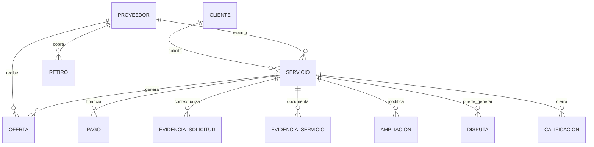

# UGO — Data & Backend Master

**Versión:** 1.1 · 11 de septiembre de 2026  
**Estado:** contrato vivo de datos, Supabase y backend  
**Rama de verdad:** `main`  
**Gobernado por:** `UGO_MASTER_GOVERNANCE.md`  
**Complementa:** `UGO_ECOSISTEMA_FLUJO.md` y `UGO_ARQUITECTURA_TECNICA_MASTER.md`

> Define cómo UGO persiste, protege, sincroniza y transforma datos. Las migraciones SQL de `main` son la evidencia ejecutable; este documento es el mapa conceptual. Ante conflicto, seguridad/integridad y el estado persistido real prevalecen.

---

# 1. Principios

- PostgreSQL/Supabase es la fuente persistente de verdad operacional.
- Cliente y Proveedor observan el mismo servicio; no existen dos estados paralelos del trabajo.
- RLS protege por rol/participación; la UI nunca reemplaza autorización.
- RPC encapsula transiciones críticas y evita mutaciones parciales.
- Realtime refleja cambios persistidos; no mantiene un segundo estado de dominio.
- Storage privado para evidencia/documentación sensible.
- Toda evolución de schema se realiza mediante migración versionada.
- DEMO y REAL deben permanecer distinguibles.
- Dinero y estados críticos deben ser auditables e idempotentes.

---

# 2. Dominios de datos

```text
Identidad/Auth · Clientes · Proveedores · Categorías
Servicios · Ofertas/Matching · Ubicación/Tracking
Pagos · Retiros · Evidencias · Ampliaciones · Disputas
Calificaciones · Notificaciones · KYC/Verificación
Scout/Analytics · Hugo/IA · Academia/Calidad · Auditoría
```

Academia consume señales de calidad y puede producir progreso/certificación; no debe modificar estados de servicio.

---

# 3. Relaciones conceptuales



Los nombres exactos de columnas/FK se verifican siempre contra migraciones vigentes.

---

# 4. Estado maestro de Servicio

```text
solicitado → buscando → ofertado → asignado
→ pago_pendiente / pago_habilitado
→ en_camino → llegado → en_progreso
→ esperando_aprobacion → completado
```

`pago_protegido` es una condición/estado específico de métodos electrónicos con custodia, no una condición universal del servicio. En efectivo, la selección válida del método puede habilitar el flujo presencial según reglas de dominio.

Excepciones: `cancelado`, `disputado`, `reembolsado`.

Las transiciones sensibles deben residir en RPC/backend, validando actor, estado anterior y precondiciones.

---

# 5. Proveedor y matching

```text
offline → available → opportunity_pending → assigned
→ busy → completion_pending → available
```

`ofertas_servicio` representa oportunidades concretas. Demanda de mercado es un concepto analítico distinto.

Contrato Cliente↔Proveedor:

```text
solicitud/serviceId
→ oferta vinculada al mismo servicio
→ proveedor autorizado analiza
→ aceptación atómica
→ asignación única
→ ambos roles observan el mismo serviceId
```

Aceptar/rechazar debe proteger contra doble aceptación y condiciones de carrera.

---

# 6. Pagos

Dominio `pagos` y APIs `/api/pagos`.

Electrónico:

```text
pendiente → autorizado → retenido/protegido
→ liberación pendiente → liberado/pagado
```

Efectivo:

```text
metodo=efectivo
procesador=efectivo
modelo_pago=presencial
estado=pendiente
→ servicio habilitado según contrato
→ proveedor confirma recepción
→ registrado/liberado
```

Reglas:

- efectivo nunca se considera electrónicamente protegido;
- reconciliar importe con servicio/ampliaciones en servidor;
- referencias externas persistentes;
- idempotencia;
- DEMO/REAL explícito;
- liberaciones/reembolsos auditables;
- UI debe poder derivar timeline desde estado real, no strings locales.

---

# 7. Ampliaciones

Tabla: `ampliaciones_servicio`.

RPC:

```text
proponer_ampliacion_servicio
resolver_ampliacion_servicio
```

Contrato:

```text
Cliente/Proveedor propone
→ pendiente
→ Cliente aprueba/rechaza
→ aprobada/rechazada/cancelada
→ reconciliación de pago
```

Datos mínimos: servicio, autor, descripción, costo extra, tiempo extra, estado, resolución e impacto de pago.

`pago_estado` puede incluir `pendiente_ajuste` cuando un pago electrónico protegido no puede modificarse silenciosamente.

---

# 8. Evidencia de solicitud

Tabla: `evidencias_solicitud`. Bucket privado: `request-evidence`.

```text
Cliente carga evidencia
→ se vincula a draft/solicitud
→ matching
→ proveedor autorizado consulta
→ decisión de oportunidad
```

Políticas: ownership, signed URLs, MIME/tamaño, acceso sólo de participantes autorizados y privacidad por defecto.

P0: reemplazar asociación temporal de evidencia huérfana por identificador explícito `draft/request id`.

---

# 9. Evidencia operacional

Tabla: `evidencias_servicio`. Bucket: `service-evidence`.

```text
antes · durante · despues · documento
```

La transición a `en_progreso` debe exigir evidencia inicial cuando el contrato lo requiera; el cierre evidencia final. El guard definitivo debe vivir en backend/RPC.

---

# 10. Realtime

Dominios: servicios, ofertas, pagos, notificaciones, ampliaciones y evidencias cuando corresponda.

- filtrar por usuario/servicio;
- cleanup obligatorio;
- evitar canales duplicados;
- refetch tras reconexión;
- no derivar autorización desde Realtime;
- persistencia confirmada antes de considerar real una mutación;
- Cliente y Proveedor convergen sobre el mismo registro de servicio.

---

# 11. Notificaciones

```text
evento de dominio → registro → destinatario → canal → entrega
```

Canales: in-app/realtime y, cuando estén configurados, push/WhatsApp/email. Eventos críticos deben originarse en backend/lógica auditable.

---

# 12. KYC y verificación

Existe `/api/kyc` y migraciones de verificación.

Separar datos públicos, estado de verificación, material KYC sensible y resolución administrativa. Información sensible no debe aparecer en vistas públicas/mapas.

---

# 13. Ubicación y mapas

Minimización por rol:

```text
Cliente   proveedor asignado / ETA
Proveedor propia ubicación + destino autorizado
Admin     operación según privilegio
Público   sin coordenadas sensibles innecesarias
```

Tracking es dato operacional; Scout debe preferir agregados geográficos.

---

# 14. Retiros

```text
saldo disponible → solicitud → validación → procesamiento
→ completado / rechazado / fallido
```

Nunca permitir retiro basado sólo en saldo calculado en frontend. Procesamiento idempotente y auditable.

---

# 15. Scout / Analytics / Academia

Scout debe usar agregados/vistas seguras y minimizar PII.

```text
demanda · cobertura · matching · aceptación · conversión
asignación · ETA · finalización · disputas · repetición
calidad · liquidez/pagos
```

Loop de calidad:

```text
Scout detecta gap
→ Admin/operación decide
→ Academia capacita
→ perfil/calidad mejora
→ oportunidades/resultados
→ Scout vuelve a medir
```

---

# 16. Migraciones

`supabase/migrations/` es historial ejecutable. Existen migraciones para Mercado Pago, mapa, PIX demo, vistas Admin, retiros, RLS de ofertas, verificación, push, notificaciones Realtime, WhatsApp cron, lifecycle de llegada, OAuth, ampliaciones y evidencias.

Reglas: migraciones reproducibles, forward-safe, RLS junto al dominio, índices adecuados, DEMO identificado, breaking changes documentados y prueba previa a producción.

---

# 17. RLS Matrix objetivo

```text
                 Cliente   Proveedor   Admin/Super
propio perfil      RW         RW          R*
servicio propio    RW         R/RW*       RW
oferta             R*         RW propia   RW
pago               R          R propia    RW
request evidence   RW         R autoriz.  R
service evidence   R/RW*      RW autoriz. RW
disputa propia     RW         RW propia   RW
KYC sensible       limitado   limitado    autorizado
config global      -          -           RW privilegiado
```

`*` depende de estado/participación. Debe verificarse con tests positivos y negativos por rol.

---

# 18. Storage

Buckets sensibles privados. Convención recomendada:

```text
<domain>/<service-or-user-id>/<uuid>.<ext>
```

Validar MIME, tamaño, ownership, acceso y expiración de signed URLs.

---

# 19. Integridad y concurrencia

Requieren atomicidad: aceptar oportunidad, cambiar estado, aprobar ampliación, autorizar/liberar/reembolsar pago, confirmar efectivo, cerrar servicio, procesar retiro y resolver disputa.

Usar RPC/transacción/constraints y estado anterior esperado. El bloqueo visual de doble click es complementario, no suficiente.

---

# 20. Contrato de eventos de dominio

Eventos conceptuales recomendados:

```text
service.requested
match.offered
match.accepted
service.assigned
payment.authorized
payment.protected
provider.on_the_way
provider.arrived
service.started
expansion.proposed
expansion.resolved
service.completion_requested
service.approved
payment.released
service.disputed
service.completed
```

No exige introducir un event bus ahora; sirve como nomenclatura común para notificaciones, analytics, Scout y auditoría.

---

# 21. Definition of Done backend

```text
migración versionada
schema/constraints
RLS
RPC/API
actor permitido + actor denegado
Realtime/Storage si aplica
happy path + error + retry
idempotencia/concurrencia
DEMO/REAL
logs/auditoría
compatibilidad frontend
Testing & Release satisfecho
```

---

# 22. Prioridades compatibles con Roadmap

P0: guards backend de evidencia, `serviceId`, RLS de flujos recientes, draft request-evidence, idempotencia financiera.  
P1: timeline de pagos por datos, notificaciones de dominio, auditoría financiera, Realtime.  
P2: vistas Scout, observabilidad, retención/privacidad y tests automatizados de policies.

---

# 23. Regla final

**Los datos de UGO cuentan una sola historia operacional.** Cliente, Proveedor, Admin, Realtime, APIs, Hugo, Scout y analítica deben converger sobre el mismo estado persistido, protegido y auditable.