# UGO — Flujo integral del ecosistema

**Documento maestro funcional · 11 de septiembre de 2026**

> UGO es un ecosistema de servicios bajo demanda que conecta clientes, proveedores y operación de plataforma en un flujo trazable, seguro y escalable. Este documento describe el recorrido completo del sistema y sirve como mapa funcional para producto, UX/UI, frontend, backend y administración.

---

## 1. Visión general

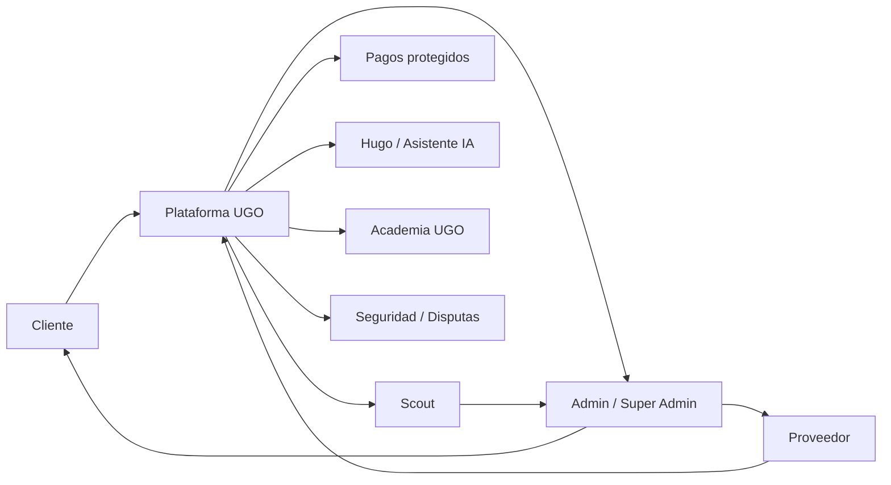

### Principio central

UGO no es solamente un buscador de profesionales. El valor del ecosistema está en **construir confianza** mediante un servicio confiable, escalable y trazable desde la solicitud hasta la finalización, pago, reputación y soporte posterior.

### Actores principales

- **Cliente:** solicita, compara/recibe proveedor, contrata, sigue, aprueba y califica.
- **Proveedor:** se registra, configura disponibilidad, recibe demanda, acepta trabajos, ejecuta y cobra.
- **Admin:** supervisa operación, usuarios, servicios, pagos, incidencias y calidad.
- **Super Admin:** controla configuración global, métricas, permisos, reglas y estrategia.
- **Scout:** transforma datos operativos en oportunidades y acciones.
- **Hugo / IA:** copiloto contextual para cliente, proveedor y operación.
- **Academia UGO:** capacitación, mejora de calidad y evolución profesional.

---

# 2. Entrada al ecosistema

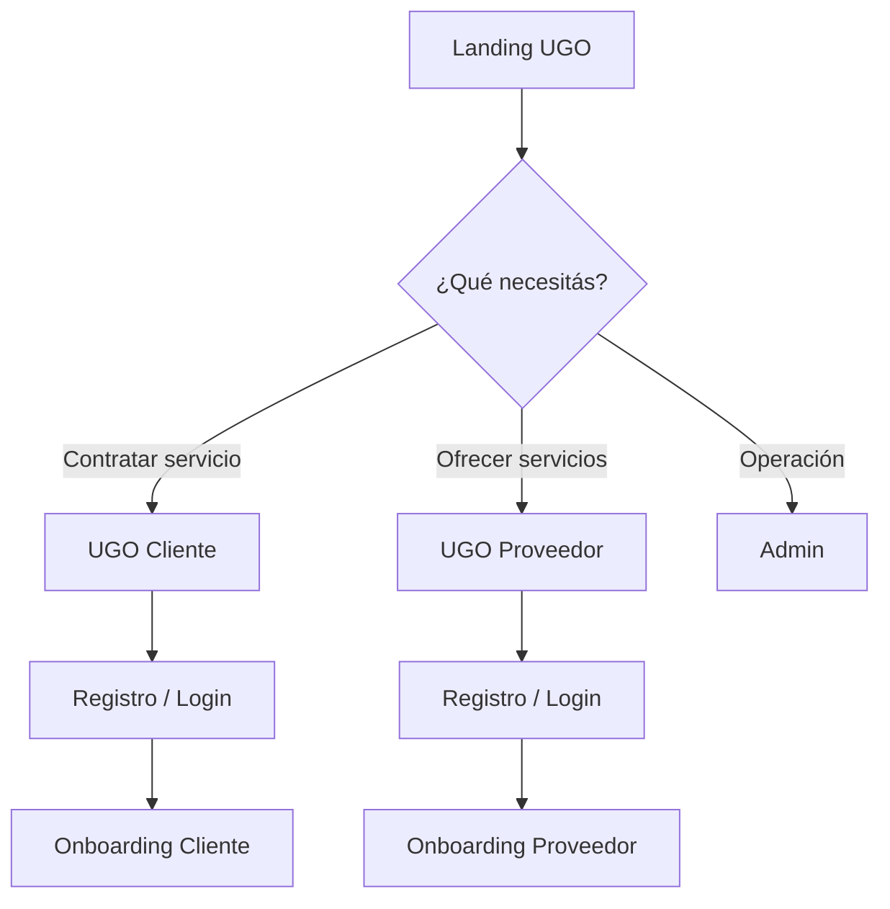

## 2.1 Landing institucional

Debe explicar:

- qué es UGO;
- cómo funciona;
- beneficios para clientes;
- beneficios para proveedores;
- seguridad y pago protegido;
- categorías disponibles;
- cobertura geográfica;
- acceso a Cliente y Proveedor;
- captación de nuevos proveedores;
- confianza, reputación y soporte.

---

# 3. Flujo completo del Cliente

## 3.1 Acceso y onboarding

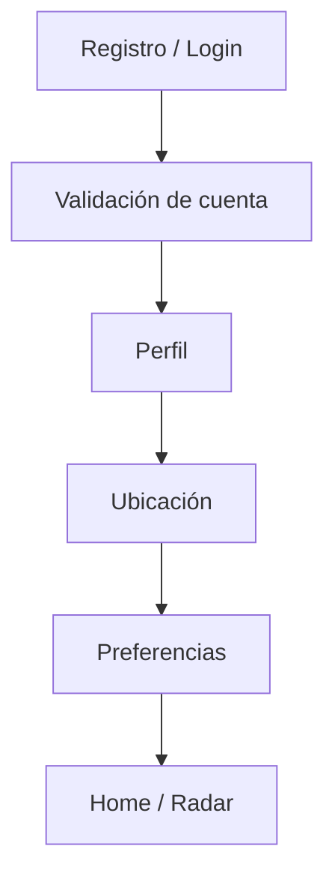

Datos principales:

- nombre y perfil;
- teléfono;
- ubicación/dirección;
- barrio/ciudad;
- idioma;
- método de contacto;
- horarios preferidos;
- instrucciones de acceso;
- preferencias de servicio.

## 3.2 Home / Radar

La Home debe permitir llegar rápidamente a una necesidad.

Elementos:

- ubicación actual;
- mapa/radar;
- búsqueda: **¿Qué servicio necesitás?**;
- categorías;
- accesos a actividad;
- servicios en curso;
- notificaciones;
- perfil;
- Hugo;
- CTA **Encontrar profesionales**.

## 3.3 Descubrimiento

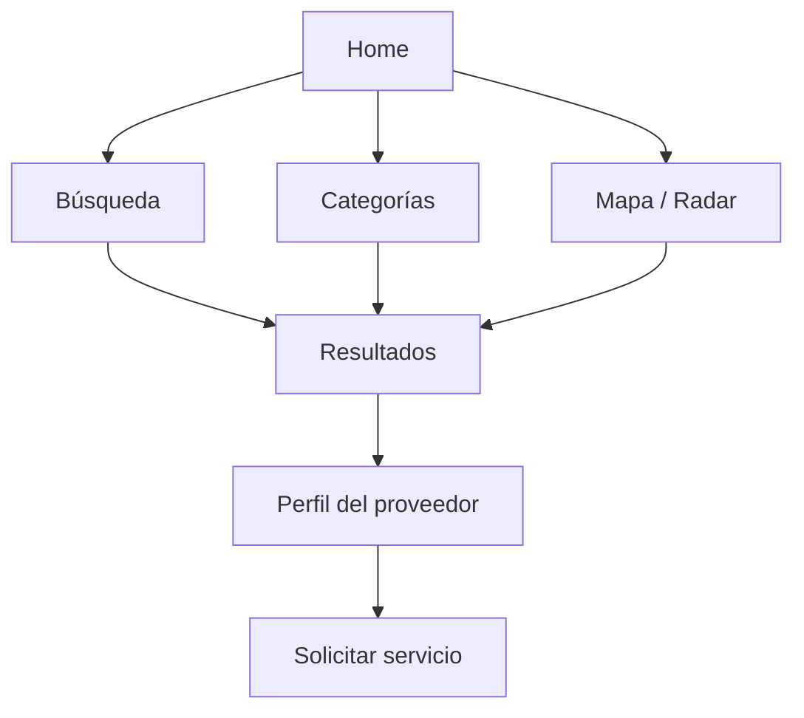

Categorías iniciales pueden incluir:

- Limpieza
- Reparación
- Electricidad
- Plomería
- y futuras categorías administrables.

## 3.4 Solicitud

El cliente define:

1. categoría;
2. descripción;
3. ubicación;
4. fecha/hora;
5. prioridad;
6. fotos o evidencia cuando corresponda;
7. observaciones;
8. presupuesto/condiciones cuando aplique.

La solicitud entra al motor de demanda y matching.

## 3.5 Matching

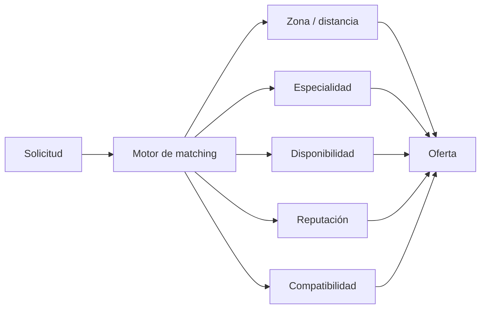

UGO debe priorizar calidad del match, disponibilidad, cercanía, reputación y equilibrio entre oferta y demanda.

## 3.6 Selección / asignación

El cliente visualiza la información necesaria del profesional y el sistema mantiene protegidos los datos que no deban revelarse antes de la contratación.

Estados:

`solicitado → buscando → oferta/match → proveedor seleccionado → asignado`

## 3.7 Pago protegido

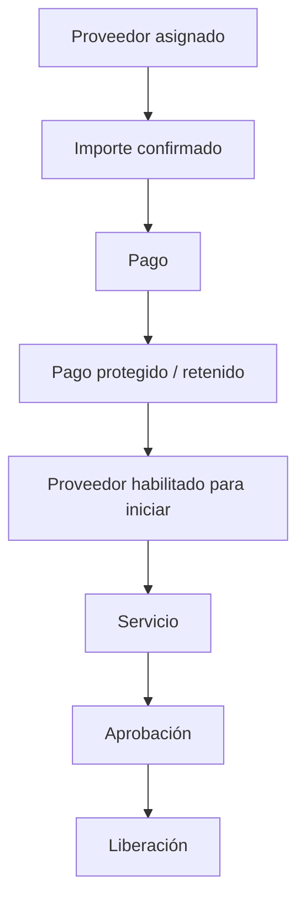

Regla crítica:

**el proveedor no debe comenzar el servicio si el contrato requiere pago protegido y éste todavía no fue confirmado.**

## 3.8 Seguimiento del servicio

Estados operativos:

`asignado → pago confirmado → en camino → llegado → en progreso → esperando aprobación → completado`

El cliente puede visualizar:

- proveedor;
- estado;
- ubicación cuando corresponda;
- ETA;
- datos del servicio;
- precio;
- comunicación;
- evidencias;
- ampliaciones;
- soporte.

## 3.9 Agregar trabajo / Ampliar servicio

Función transversal para evitar acuerdos fuera de UGO.

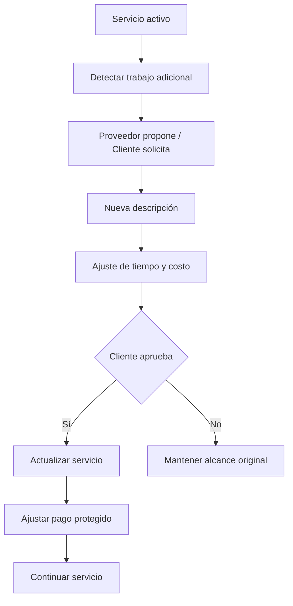

Todo cambio queda registrado con:

- descripción;
- responsable de la propuesta;
- importe;
- tiempo adicional;
- aceptación;
- fecha/hora;
- evidencia.

## 3.10 Finalización

El proveedor:

- marca trabajo terminado;
- adjunta evidencias;
- solicita aprobación.

El cliente:

- revisa resultado;
- revisa evidencias;
- aprueba;
- o abre incidencia/disputa.

## 3.11 Reputación

Después del cierre:

- calificación;
- comentario;
- calidad;
- puntualidad;
- comunicación;
- cumplimiento;
- actualización del karma/reputación.

---

# 4. Flujo completo del Proveedor

## 4.1 Registro y onboarding profesional

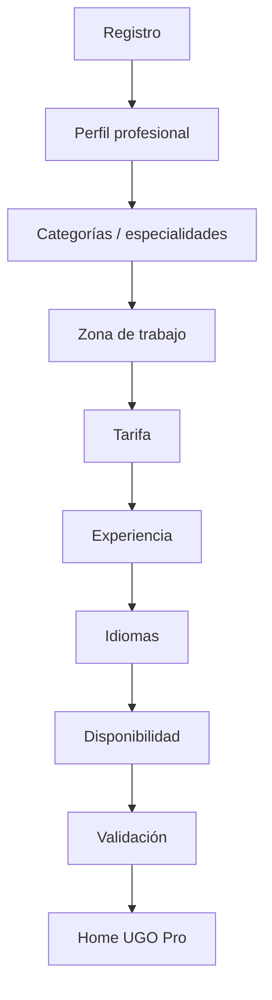

Perfil:

- bio;
- ciudad base;
- teléfono profesional;
- especialidades;
- años de experiencia;
- idiomas;
- disponibilidad;
- radio de trabajo;
- categoría principal;
- tarifa base;
- reputación;
- documentación/verificación cuando aplique.

## 4.2 Home

La Home del proveedor responde:

**¿Qué tengo que hacer ahora?**

Debe mostrar:

- Online / Offline;
- oportunidades;
- trabajo activo;
- próxima acción;
- demanda cercana;
- dinero protegido;
- dinero liberado;
- alertas;
- acceso a Hugo.

## 4.3 Demanda

La pantalla **Demanda** responde:

**¿Dónde hay trabajo para mí?**

Incluye:

- mapa;
- zonas activas;
- categorías;
- distancia;
- volumen;
- urgencia;
- valor estimado;
- tendencias;
- compatibilidad.

## 4.4 Oportunidades

Demanda y Oportunidades no son lo mismo.

- **Demanda:** panorama del mercado disponible.
- **Oportunidades:** trabajos concretos compatibles con el proveedor.

Cada oportunidad muestra:

- categoría;
- zona;
- distancia;
- antigüedad;
- descripción resumida;
- valor;
- condiciones;
- compatibilidad;
- aceptar/rechazar.

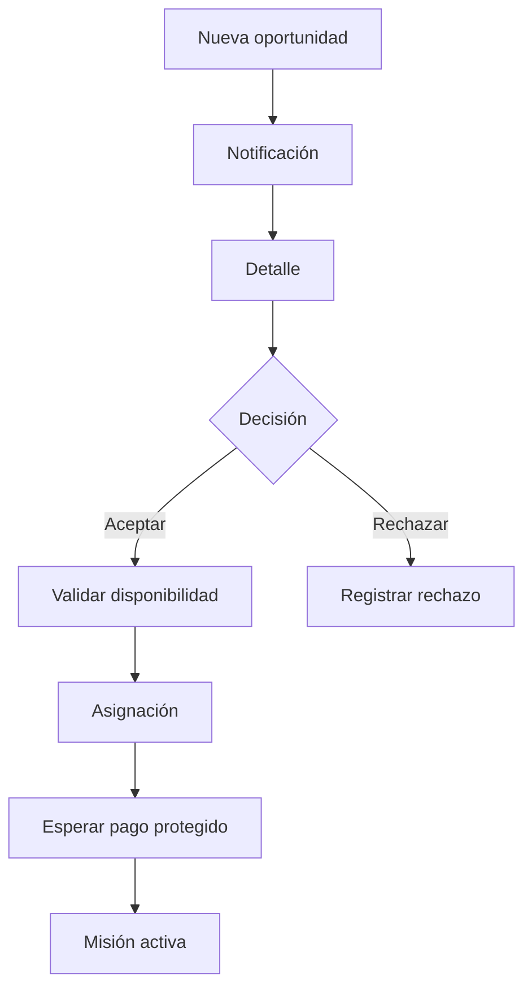

## 4.5 Misión activa

El proveedor recibe una guía operacional:

1. pago confirmado;
2. navegar al cliente;
3. marcar **En camino**;
4. marcar **Llegué**;
5. evidencia inicial;
6. iniciar;
7. ejecutar;
8. agregar/ampliar trabajo si es necesario;
9. evidencia final;
10. finalizar;
11. solicitar aprobación;
12. cobrar.

## 4.6 Hugo — Asistente de Trabajo

Hugo funciona como copiloto del proveedor **antes, durante y después**.

### Antes

- checklist;
- materiales;
- herramientas;
- recomendaciones;
- seguridad;
- contexto del trabajo.

### Durante

- ayuda técnica contextual;
- pasos;
- diagnóstico;
- registro de incidencias;
- sugerencia de ampliación del servicio;
- documentación.

### Después

- checklist final;
- evidencias;
- resumen;
- recomendaciones;
- aprendizaje;
- próximos pasos.

Hugo **no reemplaza al profesional**: reduce errores, mejora consistencia y aumenta trazabilidad.

## 4.7 Ganancias

Estados financieros:

- estimado;
- protegido/retenido;
- pendiente de liberación;
- liberado;
- pagado;
- reembolsado/disputado cuando corresponda.

---

# 5. Flujo del servicio — extremo a extremo

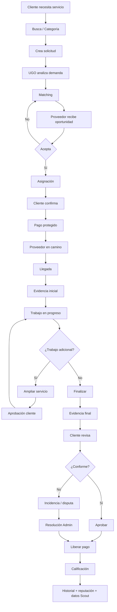

---

# 6. Admin Panel

El Admin Panel es el centro operativo.

## Módulos

### Dashboard

- servicios activos;
- solicitudes;
- proveedores online;
- demanda;
- conversión;
- GMV/ingresos;
- pagos;
- incidencias;
- calidad;
- alertas.

### Clientes

- perfiles;
- actividad;
- historial;
- incidencias;
- reputación;
- soporte.

### Proveedores

- perfil;
- disponibilidad;
- categorías;
- cobertura;
- reputación;
- trabajos;
- ganancias;
- calidad;
- validaciones;
- formación.

### Servicios

- solicitud;
- matching;
- asignación;
- estados;
- evidencias;
- ampliaciones;
- pagos;
- historial.

### Finanzas

- pagos protegidos;
- retenciones;
- liberaciones;
- comisiones;
- reembolsos;
- payouts;
- conciliación.

### Seguridad / Disputas

- incidentes;
- evidencias;
- mensajes;
- cronología;
- resolución;
- reembolso/liberación;
- sanciones cuando corresponda.

---

# 7. Super Admin

Responsable de la configuración estratégica:

- roles y permisos;
- categorías;
- zonas;
- comisiones;
- reglas de matching;
- reglas financieras;
- configuración de Scout;
- configuración de Hugo;
- campañas;
- métricas globales;
- auditoría;
- feature flags;
- integraciones;
- seguridad.

---

# 8. Scout — Inteligencia operativa

Scout debe ser una **guía de acción**, no solamente un dashboard.

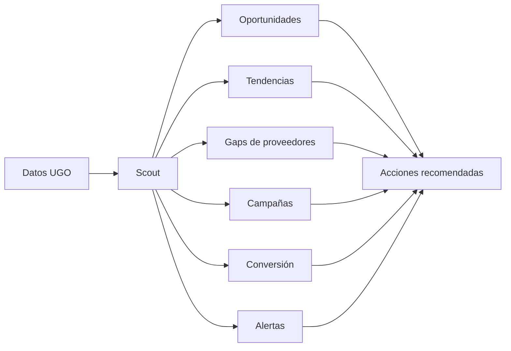

Ejemplos:

- “Alta demanda de electricistas en Canasvieiras.”
- “Faltan proveedores online en esta zona.”
- “Esta categoría perdió conversión.”
- “Conviene activar una campaña.”
- “Estos proveedores necesitan capacitación.”
- “Hay servicios demorados que requieren intervención.”

Scout conecta **dato → interpretación → recomendación → acción → resultado**.

---

# 9. Academia UGO

Objetivo: aumentar la calidad de la red.

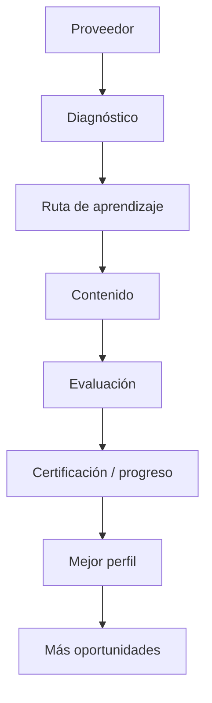

Puede incluir:

- onboarding;
- atención al cliente;
- seguridad;
- uso de UGO;
- buenas prácticas;
- módulos técnicos;
- comunicación;
- evidencia y trazabilidad;
- gestión profesional;
- certificaciones.

Scout puede detectar necesidades y derivar proveedores a Academia.

---

# 10. Seguridad y confianza

La seguridad atraviesa todo el ecosistema.

## Capas

- autenticación;
- recuperación segura de cuenta;
- roles;
- permisos;
- verificación;
- reputación;
- pago protegido;
- trazabilidad;
- evidencias;
- historial;
- privacidad;
- disputas;
- auditoría;
- prevención de acuerdos fuera de plataforma.

## Disputa

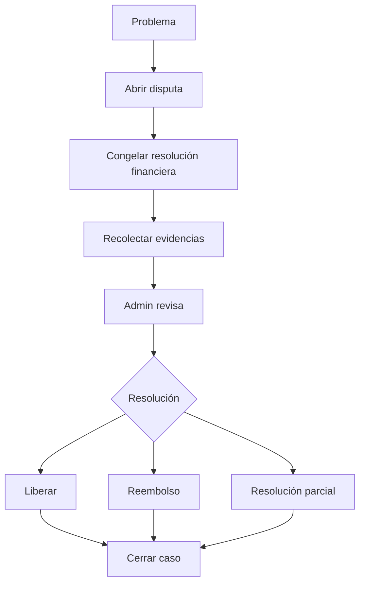

---

# 11. Notificaciones

Eventos relevantes:

- nueva oportunidad;
- proveedor asignado;
- pago confirmado;
- proveedor en camino;
- llegada;
- trabajo iniciado;
- ampliación propuesta;
- ampliación aprobada/rechazada;
- finalización;
- aprobación;
- pago liberado;
- nueva calificación;
- disputa;
- mensaje de soporte;
- alerta Scout;
- capacitación recomendada.

Canales futuros:

- in-app;
- push;
- email;
- WhatsApp cuando la integración y reglas lo permitan.

---

# 12. Estados maestros

## Servicio

```text
solicitado
→ buscando
→ ofertado
→ asignado
→ pago_pendiente
→ pago_protegido
→ en_camino
→ llegado
→ en_progreso
→ esperando_aprobacion
→ completado
```

Ramas excepcionales:

```text
cancelado
disputado
reembolsado
```

## Proveedor

```text
offline
available
opportunity_pending
assigned
busy
completion_pending
available
```

## Pago

```text
pendiente
→ autorizado
→ retenido/protegido
→ liberado
→ pagado
```

Excepciones:

```text
fallido
cancelado
reembolsado
disputado
```

---

# 13. Contratos UX globales

Toda UGO debe mantener:

- una acción primaria clara por pantalla;
- lenguaje consistente;
- feedback inmediato;
- estados loading / empty / error / success;
- targets táctiles mínimos consistentes;
- safe areas móviles;
- navegación predecible;
- accesibilidad;
- diseño responsive;
- componentes reutilizables;
- tokens del design system;
- trazabilidad de acciones críticas;
- no duplicar patrones entre Cliente y Proveedor.

### Regla UX

**Estado → contexto → próxima acción.**

El usuario siempre debe saber:

1. qué está pasando;
2. qué significa;
3. qué tiene que hacer ahora.

---

# 14. Arquitectura funcional

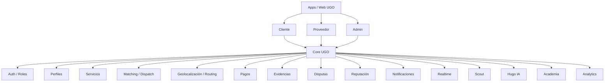

---

# 15. Rutas principales del producto

Rutas/entradas actuales a preservar conceptualmente:

```text
?app=client
?app=provider
?app=admin
?app=web
?app=client-web
```

La evolución debe mantener cada rol encapsulado y evitar que el crecimiento de Proveedor rompa el flujo de Cliente.

---

# 16. Design System

Fuente común para:

- colores;
- tipografía;
- spacing;
- radios;
- sombras;
- botones;
- inputs;
- cards;
- sheets;
- navegación;
- mapas;
- badges;
- estados;
- feedback;
- responsive.

Cliente, Proveedor y Admin pueden tener distinta densidad de información, pero deben sentirse parte del **mismo UGO**.

---

# 17. Ciclo de datos

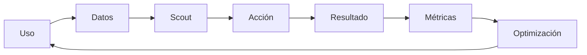

Métricas clave:

- tiempo hasta match;
- aceptación;
- cancelación;
- conversión;
- tiempo de llegada;
- duración;
- ampliaciones;
- ticket promedio;
- disputas;
- satisfacción;
- recurrencia;
- oferta/demanda;
- utilización de proveedores;
- retención;
- ingresos;
- calidad.

---

# 18. Prioridades de ejecución

UGO debe proteger seis prioridades:

1. **Foco:** no abrir más frentes de los que pueden cerrarse correctamente.
2. **Calidad:** un servicio malo destruye confianza.
3. **Oferta vs. demanda:** mantener suficientes proveedores adecuados donde existe demanda.
4. **UX:** reducir fricción en contratación y ejecución.
5. **Resolución:** intervenir rápido ante problemas.
6. **Datos:** usar la actividad real para mejorar continuamente.

---

# 19. Roadmap funcional

## Fase 1 — Core operativo

- Cliente completo.
- Proveedor Home / Demanda / Oportunidades.
- matching;
- servicio activo;
- pago protegido;
- estados;
- historial;
- reputación;
- disputas.

## Fase 2 — Calidad operacional

- evidencias;
- ampliar servicio;
- Hugo / Asistente de Trabajo;
- notificaciones;
- mejoras de routing;
- controles de calidad.

## Fase 3 — Inteligencia

- Scout;
- mapas de demanda;
- gaps de proveedores;
- alertas;
- recomendaciones;
- campañas;
- analítica avanzada.

## Fase 4 — Ecosistema

- Academia UGO;
- certificaciones;
- beneficios;
- alianzas;
- automatización;
- expansión geográfica;
- optimización avanzada de marketplace.

---

# 20. Mapa maestro

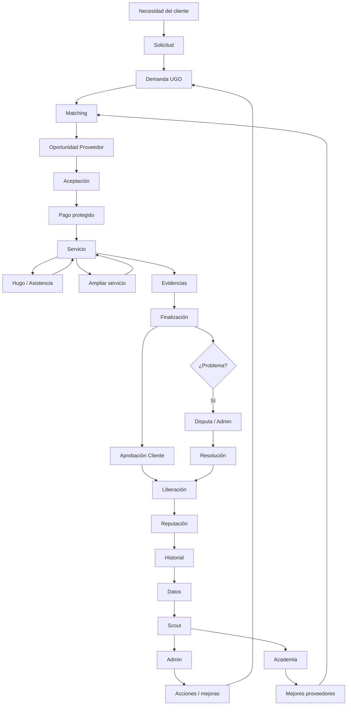

---

# 21. Resultado esperado

Cuando el ecosistema está completo, UGO forma un circuito cerrado:

**Necesidad → búsqueda → matching → contratación → pago protegido → ejecución → evidencia → aprobación → cobro → reputación → datos → inteligencia → mejora.**

El objetivo no es únicamente conseguir un profesional. Es que **Cliente, Proveedor y UGO sepan en todo momento qué está ocurriendo, qué está protegido, qué acción sigue y qué registro queda del servicio**.

---

## Documento vivo

Este archivo debe actualizarse cada vez que se incorpore un flujo transversal importante, cambie un estado maestro, aparezca un nuevo rol o se modifique un contrato crítico de Cliente, Proveedor, Admin, Scout, Hugo, Academia, pagos o seguridad.
