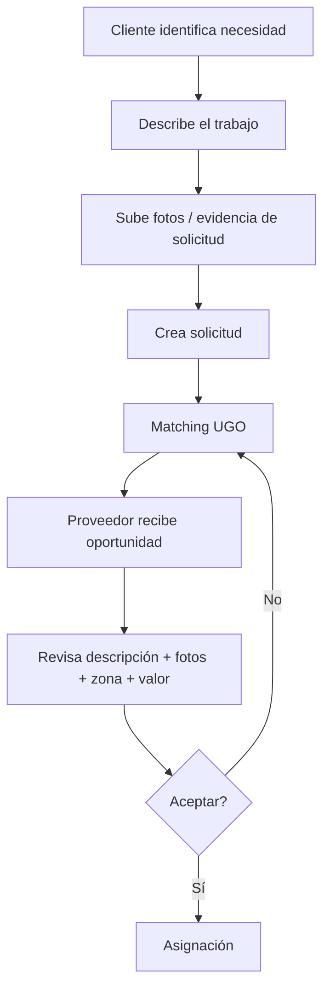

# UGO — Evidencia de solicitud previa al matching

Este contrato complementa el documento maestro `docs/UGO_ECOSISTEMA_FLUJO.md`.

## Regla de producto

Antes del matching, el Cliente puede subir fotos del trabajo a realizar para que el Proveedor pueda analizar mejor la oportunidad antes de aceptar o rechazar.

## Separación de evidencias

- **Evidencia de solicitud:** aportada por el Cliente antes del matching. Explica el problema o trabajo requerido.
- **Antes:** aportada por el Proveedor al llegar; registra cómo encontró el trabajo.
- **Durante:** documenta avances/incidencias.
- **Después:** registra el resultado final y habilita la revisión del Cliente.

La evidencia de solicitud no reemplaza las evidencias operativas del servicio.

## Privacidad

Las fotos previas son privadas. El Cliente puede ver sus borradores y el Proveedor sólo puede ver las fotos cuando existe una oportunidad/oferta de ese servicio dirigida a él. No deben exponerse públicamente.

## Contrato UX

Cliente: `Necesidad → descripción → fotos opcionales → enviar solicitud → matching`.

Proveedor: `Oportunidad → descripción → fotos del Cliente → distancia/valor/condiciones → aceptar o rechazar`.

## Implementación

- Tabla: `public.evidencias_solicitud`.
- Storage privado: `request-evidence`.
- Vinculación automática al crear `servicios`.
- UI Cliente: `ClientRequestEvidence`.
- UI Proveedor: `ProviderRequestEvidence` dentro del detalle de oportunidad.
- Las evidencias operativas continúan en `evidencias_servicio` / `service-evidence`.
