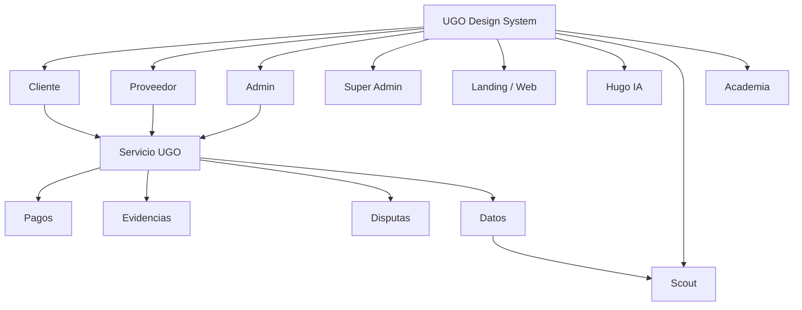

# UGO — UI/UX Master · Google Stitch

**Documento maestro de diseño del ecosistema UGO**  
**Versión:** 1.0 · 11 de septiembre de 2026  
**Estado:** contrato vivo · fuente de verdad para diseño, prototipado e implementación  
**Herramienta de diseño asistido:** Google Stitch  
**Complementa:** `docs/UGO_ECOSISTEMA_FLUJO.md` y `docs/UGO_UIUX_MAESTRO.md`

> Este documento traduce el producto UGO a un contrato UI/UX utilizable tanto por personas como por Google Stitch y por agentes de implementación. El flujo maestro define **qué ocurre**. Este documento define **cómo se organiza, se entiende, se diseña y se implementa visualmente**.

---

# 1. Objetivo

UGO es un marketplace operativo de servicios que conecta clientes con proveedores y mantiene trazabilidad desde la necesidad hasta el cierre del trabajo.

Circuito maestro:

```text
Necesidad → búsqueda → matching → contratación → pago → ejecución → evidencia → aprobación → cobro → reputación → datos → inteligencia → mejora
```

Todo diseño debe sostener la regla:

## Estado → contexto → próxima acción

Cada pantalla debe responder:

1. ¿Qué está pasando?
2. ¿Qué significa para este usuario?
3. ¿Qué debe hacer ahora?

---

# 2. Cómo usar este documento con Google Stitch

Google Stitch se utiliza como **acelerador de exploración y producción visual**, no como nueva fuente de verdad del producto.

Orden obligatorio:

```text
Flujo maestro UGO
→ contrato UI/UX maestro
→ prompt de pantalla para Stitch
→ propuesta visual
→ revisión contra contratos UGO
→ adaptación al Design System real
→ implementación React/CSS
→ prueba responsive, estados y accesibilidad
```

## 2.1 Regla Stitch

Una pantalla generada por Stitch **no debe implementarse literalmente** si contradice:

- estados reales del servicio;
- arquitectura Cliente/Proveedor/Admin;
- seguridad o privacidad;
- pagos;
- RLS/roles;
- componentes canónicos;
- navegación existente;
- accesibilidad;
- responsive;
- safe areas;
- lenguaje UGO.

Stitch propone la composición. El repositorio UGO conserva la autoridad funcional.

## 2.2 Contexto mínimo para todo prompt Stitch

Todo prompt debe indicar:

```text
Producto: UGO
Tipo: marketplace de servicios locales
Estética: moderna, confiable, tecnológica, humana y operacional
Design language: Kinetic Trust
Mobile reference: 390 × 844
Touch targets: mínimo 48 × 48
Regla UX: Estado → contexto → próxima acción
Primary: verde UGO
Hugo/IA: acento cyan/secondary
Cards: superficies limpias, radios consistentes
Mobile: safe areas + navegación alcanzable con una mano
No inventar nuevas funciones ni estados
No alterar contratos funcionales del flujo maestro
```

---

# 3. Ecosistema visual



Todas las superficies deben sentirse como partes de un mismo producto, aunque su densidad sea distinta.

---

# 4. Design System maestro

La implementación debe converger sobre `src/mvp/ugo-design-system.css` y las primitivas compartidas existentes.

## 4.1 Identidad

UGO debe sentirse:

- confiable;
- local;
- simple;
- profesional;
- rápido;
- humano;
- trazable;
- activo sin ser visualmente agresivo.

Evitar estética de clasificados, exceso de gradientes, glassmorphism decorativo, dashboards genéricos y pantallas llenas de widgets sin prioridad.

## 4.2 Color semántico

```text
Primary / confianza       #006948
Primary container         #00855d
Secondary / Hugo          #00687a
Tertiary / información    #0058be
Error                     #ba1a1a
Warning                   #b45309
Surface                   #faf8ff
Surface lowest            #ffffff
On surface                #131b2e
Outline variant           #bccac0
```

No crear un verde diferente para cada módulo.

## 4.3 Tipografía

```text
Plus Jakarta Sans → principal
Inter / system-ui → fallback
```

Jerarquía recomendada:

- Display: 32–40
- H1: 28–32
- H2: 22–26
- H3: 18–20
- Body: 14–16
- Metadata: 12–13
- Eyebrow: 10–12

## 4.4 Espaciado

```text
4 / 8 / 12 / 16 / 20 / 24 / 32 / 40
```

## 4.5 Radios

```text
control 12
card 16
sheet 24
pill/avatar full
```

## 4.6 Interacción

- touch target mínimo 48 px;
- una acción primaria dominante por contexto;
- feedback inmediato;
- disabled visible pero legible;
- no depender sólo del color;
- confirmar acciones irreversibles;
- prevenir doble envío;
- preservar foco y navegación por teclado en web.

## 4.7 Estados obligatorios

Todo componente con datos debe diseñar:

```text
loading
loaded
empty
error
retry
offline/degraded
```

Toda mutación:

```text
idle → submitting → success
                  ↘ error → recovery
```

---

# 5. Componentes canónicos

Antes de crear componentes nuevos, reutilizar o extender las primitivas UGO:

```text
Button
IconButton
Input
Search
Card
Badge
Avatar
TopBar
BottomNavigation
BottomSheet
Drawer
Modal
FloatingActionButton
EmptyState
ErrorState
RetryState
SuccessState
OfflineState
```

Componentes transversales del ecosistema:

```text
StatusCard
ServiceCard
ProviderCard
PaymentStatus
EvidenceCard
Timeline
MapPanel
ActionSheet
HugoDock
NotificationItem
AlertCard
KpiCard
DecisionCard
```

---

# 6. Cliente · arquitectura UI/UX

Navegación principal:

```text
Inicio · Servicios · Actividad · Perfil
```

Journey:

```text
Login/Onboarding
→ Home/Radar
→ Buscar/Categoría
→ Proveedor
→ Solicitud
→ Matching
→ Asignación
→ Pago
→ Tracking
→ Servicio activo
→ Ampliación si corresponde
→ Evidencias
→ Aprobación/Disputa
→ Pago cerrado
→ Calificación
→ Historial
```

## 6.1 Home / Radar

Pregunta: **¿Qué necesitás resolver hoy?**

Jerarquía:

1. ubicación;
2. búsqueda/Hugo;
3. categorías;
4. profesionales/disponibilidad;
5. servicio activo si existe;
6. actividad secundaria.

Stitch debe priorizar una experiencia mobile-first con mapa útil, bottom sheet limpio y CTA claro. El mapa nunca debe impedir contratar si falla.

## 6.2 Solicitud

```text
Servicio
→ Detalles + fotos
→ Dirección + cuándo
→ Presupuesto/resumen
→ Confirmar
```

Las fotos del problema forman parte del formulario y deben explicar que ayudan al proveedor a evaluar el trabajo.

## 6.3 Matching

Nunca mostrar sólo un spinner. Mostrar búsqueda activa, categoría/zona, progreso comprensible y alternativas si no hay proveedores.

## 6.4 Servicio activo

Debe concentrar:

- proveedor;
- estado;
- ETA/mapa;
- pago;
- evidencia;
- ampliar trabajo;
- ayuda/disputa;
- próxima acción.

## 6.5 Pago

Electrónico:

```text
pendiente → confirmado → protegido → liberación pendiente → liberado
```

Efectivo:

```text
seleccionado → presencial pendiente → proveedor confirma recepción → registrado
```

Nunca presentar efectivo como pago electrónicamente protegido.

---

# 7. Proveedor · arquitectura UI/UX

Navegación principal:

```text
Inicio · Demanda · Trabajos · Perfil
```

## 7.1 Inicio

Pregunta: **¿Qué tengo que hacer ahora?**

Mostrar:

- Online/Offline;
- oportunidades;
- trabajo activo;
- próxima acción;
- demanda cercana;
- dinero protegido;
- dinero liberado;
- alertas;
- Hugo.

## 7.2 Demanda

Pregunta: **¿Dónde hay trabajo para mí?**

Demanda es panorama del mercado, no lista de ofertas. Debe usar mapa, zonas, categorías, volumen, urgencia, distancia, valor estimado y tendencia.

## 7.3 Oportunidades

Oportunidad = trabajo concreto compatible.

Card mínima:

```text
categoría
zona
distancia
antigüedad
descripción
valor
compatibilidad
condiciones
Aceptar / Rechazar
```

Aceptar debe bloquear doble acción y esperar confirmación real antes de cambiar de pantalla.

## 7.4 Misión activa

```text
Pago autorizado
→ En camino
→ Llegué
→ Evidencia antes
→ Iniciar
→ En progreso
→ Ampliar servicio si hace falta
→ Evidencia durante/después
→ Finalizar
→ Aprobación
→ Cobro
```

## 7.5 Hugo · Asistente de Trabajo

Hugo acompaña al proveedor:

- antes: checklist, materiales, seguridad, contexto;
- durante: diagnóstico, pasos, recomendaciones, incidencias, ampliación;
- después: checklist final, evidencia, resumen y aprendizaje.

Debe sentirse como copiloto contextual, no chatbot flotante desconectado.

---

# 8. Ampliar servicio / Agregar trabajo

Patrón transversal Cliente + Proveedor.

```text
Necesidad adicional
→ propuesta
→ descripción
→ costo extra
→ tiempo extra
→ cliente aprueba/rechaza
→ pago se ajusta de forma trazable
→ servicio continúa
```

UX obligatoria:

- nunca esconder costo/tiempo adicional;
- indicar quién propuso;
- estado visible;
- aprobación explícita;
- historial permanente;
- evitar acuerdos fuera de UGO.

---

# 9. Evidencias

Tres etapas operativas:

```text
Antes · Durante · Después
```

Además existe evidencia previa de solicitud enviada por Cliente.

No mezclar ambos conceptos.

UX:

- preview;
- tipo;
- fecha/hora;
- descripción;
- autor cuando corresponda;
- estado de carga;
- retry;
- acceso dentro del servicio activo y revisión final.

---

# 10. Admin · Control Center

Admin no debe ser una colección de dashboards. Debe responder:

**¿Qué requiere atención y qué decisión debo tomar?**

Arquitectura:

```text
Inicio
Operaciones
Personas
Finanzas
Seguridad / Disputas
Scout
Reportes
Configuración
```

Patrón de pantalla:

```text
Contexto
→ KPIs esenciales
→ prioridades/alertas
→ lista o mapa operacional
→ detalle
→ acción
→ confirmación/auditoría
```

Densidad mayor que Cliente/Proveedor, pero mismo lenguaje de estados, color y componentes.

---

# 11. Super Admin

Super Admin gobierna el sistema.

Debe incluir conceptualmente:

```text
Command Center
Roles / permisos
Feature flags
Categorías
Zonas
Matching
Finanzas
Scout
Hugo
Integraciones
Auditoría
Métricas globales
```

Toda modificación crítica debe mostrar alcance, impacto, confirmación y registro.

---

# 12. Scout

Scout es una **guía de acción**.

```text
Dato → interpretación → recomendación → acción → resultado
```

No diseñar Scout como un BI pasivo.

Cada insight debe responder:

- qué ocurre;
- dónde;
- por qué importa;
- magnitud/confianza;
- acción recomendada;
- CTA para ejecutar o investigar.

Ejemplos:

- alta demanda sin cobertura;
- gaps de proveedores;
- baja conversión;
- servicios demorados;
- campaña recomendada;
- proveedores que necesitan capacitación.

---

# 13. Academia UGO

Journey:

```text
Diagnóstico
→ ruta de aprendizaje
→ contenido
→ evaluación
→ progreso/certificación
→ impacto en perfil/oportunidades
```

La UI debe conectar aprendizaje con beneficio profesional concreto.

---

# 14. Landing y Web pública

Objetivo: explicar UGO y convertir.

Jerarquía:

```text
Promesa
→ cómo funciona
→ confianza
→ Cliente / Proveedor
→ categorías/cobertura
→ seguridad
→ CTA
```

La landing puede usar una presentación dark/mint más expresiva, pero debe mantener la identidad semántica UGO y no convertirse en un sistema visual separado.

Mobile: CTA Cliente/Proveedor accesibles y persistentes sin tapar contenido.

---

# 15. Mapas

Mapas aparecen en Cliente, Proveedor, Admin y Scout, pero con objetivos diferentes.

Cliente:
- ubicación;
- proveedores;
- tracking;
- ETA.

Proveedor:
- demanda;
- oportunidad;
- ruta al cliente.

Admin:
- operación;
- concentración;
- incidencias;
- cobertura.

Scout:
- patrones;
- gaps;
- oportunidades.

Reglas:

- mapa siempre tiene contexto textual;
- no depender sólo de pin/color;
- selected state inequívoco;
- fallback de lista;
- controles táctiles 48 px;
- atribución cartográfica cuando corresponda.

---

# 16. Pagos y dinero

Dinero exige máxima claridad.

Mostrar siempre cuando corresponda:

```text
importe
método
estado
comisión
monto proveedor
protección o ausencia de protección
fecha relevante
próxima acción
```

No usar “pagado”, “liberado”, “retenido” y “protegido” como sinónimos.

DEMO y REAL deben ser visualmente distinguibles en Admin.

---

# 17. Disputas y seguridad

Journey:

```text
Problema
→ abrir disputa
→ explicar impacto
→ evidencia
→ revisión
→ resolución
→ consecuencia financiera
→ cierre
```

El diseño debe ser calmado, preciso y auditable. Evitar mensajes acusatorios antes de resolución.

---

# 18. Notificaciones

Notificar cambios que modifican una decisión o próxima acción:

```text
nueva oportunidad
proveedor asignado
pago confirmado
proveedor en camino
llegada
trabajo iniciado
ampliación propuesta/aprobada/rechazada
finalización
aprobación
pago cerrado
calificación
disputa
alerta Scout
capacitación recomendada
```

Cada notificación debe llevar al contexto correcto, no simplemente a Home.

---

# 19. Responsive

Breakpoints de validación:

```text
390 mobile base
480 mobile amplio
768 tablet
1024 desktop compacto
1440 desktop amplio
```

Reglas:

- diseñar mobile-first Cliente/Proveedor;
- Admin desktop-first con adaptación mobile;
- evitar scroll horizontal;
- no usar alturas fijas que rompan WebView;
- usar safe areas;
- teclado no debe tapar CTA/campo activo;
- sheets deben poder scrollear internamente;
- tablas densas se convierten en cards/listas en mobile cuando corresponda.

---

# 20. Accesibilidad

Objetivo mínimo: WCAG AA en contraste y comportamiento esencial.

- targets 48 px;
- labels reales;
- foco visible;
- orden lógico;
- `aria-live` para estados asincrónicos importantes;
- iconos con texto/label cuando sean acciones;
- no depender sólo de color;
- `prefers-reduced-motion`;
- mensajes de error accionables;
- campos con error asociado.

---

# 21. Microcopy UGO

UGO habla como un coordinador confiable.

Preferir:

```text
“Tu proveedor está en camino”
“Falta confirmar el pago”
“No encontramos profesionales disponibles en esta zona”
“Podés ampliar el radio o intentar nuevamente”
```

Evitar:

```text
“Error 500”
“RPC failed”
“Status updated”
“Invalid state transition”
```

El detalle técnico va a logs/Admin, no al usuario final.

---

# 22. Prompt maestro para Google Stitch

Usar esta base y agregar el objetivo específico de cada pantalla:

```text
Diseñá una pantalla production-ready para UGO, marketplace de servicios locales.

Rol: [Cliente / Proveedor / Admin / Super Admin]
Pantalla: [nombre]
Objetivo del usuario: [objetivo]
Estado actual: [estado real del flujo]
Próxima acción principal: [CTA]

Usar el lenguaje visual UGO “Kinetic Trust”: confiable, humano, local, tecnológico y profesional.
Primary verde UGO #006948, secondary/Hugo #00687a, superficies claras, jerarquía fuerte, cards de radio 16 px, controles 12 px, sheets 24 px.
Tipografía Plus Jakarta Sans con fallback Inter.

Para Cliente/Proveedor usar mobile-first 390×844, safe areas, touch targets mínimos 48×48 y navegación alcanzable con una mano.
Para Admin usar control-center responsive con densidad profesional y decisiones priorizadas.

Aplicar siempre la regla:
ESTADO → CONTEXTO → PRÓXIMA ACCIÓN.

Diseñar explícitamente loading, empty, error, success y disabled cuando correspondan.
No inventar nuevas funciones, estados de servicio, métodos de pago ni navegación.
No cambiar la arquitectura funcional UGO.
No duplicar patrones que ya pertenecen al Design System.
El resultado debe poder traducirse a React + CSS responsive y reutilizable.
```

---

# 23. Plantilla Stitch por pantalla

Antes de pedir una pantalla completar:

```md
## [ROL] · [PANTALLA]

### Objetivo
...

### Estado de entrada
...

### Información obligatoria
- ...

### Acción primaria
...

### Acciones secundarias
- ...

### Estados
- loading
- empty
- error
- success
- offline/degraded

### Navegación
Entrada: ...
Salida principal: ...
Back: ...

### Componentes UGO
- ...

### Responsive
390: ...
768: ...
1024+: ...

### Restricciones
- no inventar lógica
- mantener contratos del flujo maestro
- respetar design tokens
```

---

# 24. Contrato de handoff Stitch → GitHub

Una propuesta visual se considera lista para implementación sólo cuando:

- corresponde al rol correcto;
- respeta el flujo real;
- tiene CTA principal inequívoco;
- contempla estados asincrónicos;
- no introduce navegación paralela;
- reutiliza tokens/componentes UGO;
- es responsive;
- es accesible;
- no rompe pagos, evidencia, matching o seguridad;
- puede mapearse a componentes del repo.

Handoff esperado:

```text
Stitch screen
→ identificar componentes compartidos
→ mapear datos/acciones reales
→ implementar sin duplicar flujo
→ validar TypeScript/build
→ validar mobile
→ validar estados
→ validar rol/RLS
→ commit pequeño y trazable
```

---

# 25. Definition of Done UI/UX

Una pantalla UGO está terminada cuando:

- [ ] responde Estado → contexto → próxima acción;
- [ ] tiene una acción primaria clara;
- [ ] usa tokens UGO;
- [ ] usa/reutiliza componentes canónicos;
- [ ] loading está diseñado;
- [ ] empty está diseñado;
- [ ] error + retry están diseñados;
- [ ] success/feedback está diseñado;
- [ ] acciones críticas bloquean doble submit;
- [ ] mobile 390 funciona;
- [ ] tablet 768 funciona;
- [ ] desktop cuando aplica funciona;
- [ ] safe areas funcionan;
- [ ] teclado mobile no bloquea interacción;
- [ ] touch targets ≥48 px;
- [ ] contraste/foco/labels son accesibles;
- [ ] no depende sólo del color;
- [ ] microcopy es humano;
- [ ] estados financieros son inequívocos;
- [ ] navegación no duplica otro flujo;
- [ ] comportamiento real está conectado;
- [ ] TypeScript/build pasan;
- [ ] se verificó que no rompió Cliente/Proveedor/Admin.

---

# 26. Prioridad de convergencia visual

```text
P0 · contratos críticos y errores de UX
P1 · Cliente operacional completo
P2 · Proveedor operacional completo
P3 · Admin/Super Admin
P4 · Scout/Hugo/Academia
P5 · Landing/Web y refinamiento transversal
```

No realizar una reescritura visual masiva. Migrar journey por journey y validar build entre etapas.

---

# 27. Regla para futuras generaciones con Stitch

Cada nueva pantalla debe partir de este documento y del flujo funcional existente.

**Stitch no crea un UGO alternativo. Stitch ayuda a diseñar mejor el UGO real.**

Cuando Stitch proponga un patrón superior, se incorpora al Design System antes de replicarlo en varias pantallas.

La consistencia se evalúa en el journey completo, no sólo en screenshots individuales.

---

# 28. Resultado esperado

Cliente, Proveedor, Admin, Super Admin, Scout, Hugo, Academia y Web deben parecer distintas vistas del mismo sistema.

La experiencia completa debe comunicar:

**UGO sabe qué está pasando, protege el contexto del servicio, registra las decisiones y siempre muestra qué sigue.**

---

## Documento vivo

Actualizar este archivo cuando:

- cambie un contrato visual transversal;
- se adopte un patrón Stitch como patrón UGO;
- aparezca un nuevo rol o superficie;
- cambie navegación;
- cambien estados maestros;
- cambie el Design System;
- se incorpore un nuevo patrón de pago, evidencia, seguridad o asistencia.

No actualizarlo por cambios cosméticos aislados.